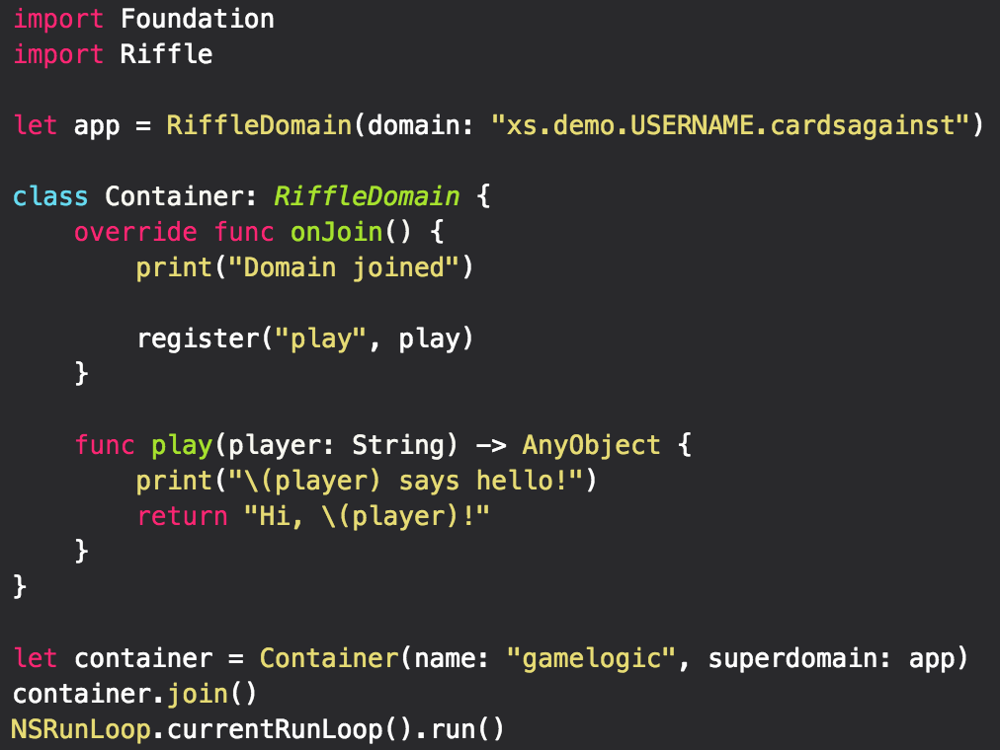
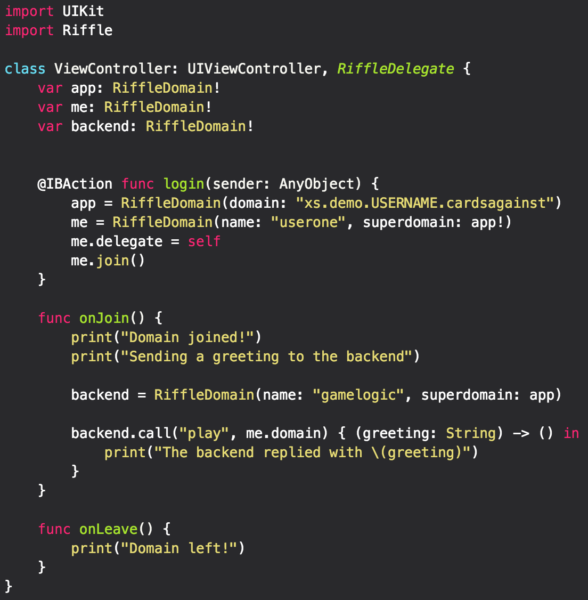

    
  <h3>Stop writing network code. Seriously.</h3>

  
  
  

Find documentation at [docs.exis.io](http://docs.exis.io). See our splash page at [exis.io](exis.io). 

## Why Exis?
While we were developing Exis, simplicity and ease of use was at our highest priority.  With Exis, if you can make a function call, you can create incredibly complex apps in just minutes.  
No more needing to worry about learning several languages to create the backend suited for your needs.  Instead, use the languages that you know and are comfortable with.  We support WebSockets and HTTP - so if your device can talk to HTTP, it can use Exis.

### Example Code

<table align="center" border="0">

<tr>
<td>  </td>
<td>  </td>
</tr>

</table>

### Getting Started
Feel free to check out the examples directory where you can find Xcode projects that will show you how to get started using Exis.
* [Hello, World! Swift Backend Example](https://github.com/exis-io/Exis/tree/master/swift/example)
  * A very basic example Xcode example to show you how to write your backend in Swift
* [Cards Against Humanity Example](https://github.com/exis-io/CardsAgainst)
	* Cards Against step-by-step [Tutorial](http://docs.exis.io/#/pages/samples/SwiftCardsTutorial.md)
	* Here is a simple project that we created to show how powerful Exis is

### More Information
For more information on the how to incorporate Exis with your projects , please visit [exis.io](http://exis.io) or visit our [documentation page](http://docs.exis.io/#/pages/general/Home.md) to see more in depth tutorials.

<!-- 
Notes on setting up environment from scratch

Cloning 
	- Install pip
		- Requirements.txt: docopt, virtualenv
	- Install Go (use GVM or godeps?)
		- Set GOPATH, GOBIN

Python
	- Install gopy
	- Install riffle OR virtualenv (latter is vastly preferred!)

Js
	- Install node, npm, nvm
	- npm link 

Swift
	- 

# To debug and extract the build commands, check golang.org/x/mobile/cmd/gomobile/bind_iosapp.go
# This is where the commands are emitted to create the library 
#
# Make changes, then 'go install' in golang.org/x/mobile/cmd/gomobile

# It seems very, very possible to get non-arm jni auto-bindings out of gomobile.
# golang.org/x/mobile/cmd/gomobile/bind_androidapp.go builds the library with the following env params: 
#
# 	[GOOS=android GOARCH=arm GOARM=7 CC=/home/damouse/code/go/pkg/gomobile/android-ndk-r10e/arm/bin/arm-linux-androideabi-gcc CXX=/home/damouse/code/go/pkg/gomobile/android-ndk-r10e/arm/bin/arm-linux-androideabi-g++ CGO_ENABLED=1]
#
# We can a) switch out native ubuntu params and b) put the library in an x86 location pretty easily. 
# Also, check this out: 
# 	gobind -lang=java github.com/exis-io/core/androidMantle
# Language bindings between java and go

# Orphaned-- don't use yet
ios: 
	# Build using gomobile, generating a framework. Orphaned, but may work

	# Run directly
	# go run ~/code/go/src/golang.org/x/mobile/cmd/gomobile/bind.go -target=ios github.com/exis-io/core/iosMantle

	gomobile bind -target=ios github.com/exis-io/core/iosMantle
	rm -rf swift/iosCrust/RiffleTesterIos/IosMantle.framework
	mv IosMantle.framework swift/iosCrust/RiffleTesterIos/IosMantle.framework

	# Attempt to build a static library cross compiled for ARM. Currently not functional
	# GOARM=7 CGO_ENABLED=1 GOARCH=arm CC_FOR_TARGET=`pwd`/swift/clangwrap.sh CXX_FOR_TARGET=`pwd`/swift/clangwrap.sh go build -buildmode=c-archive -o utils/assets/riffmantle.a core/cMantle/main.go
	# GOARM=7 CGO_ENABLED=1 GOARCH=arm go build -buildmode=c-archive -o utils/assets/riffmantle.a core/cMantle/main.go

	# cp utils/assets/riffmantle.a swift/twopointone/Pod/Classes/riffmantle.a
	# cp utils/assets/riffmantle.h swift/twopointone/Pod/Classes/riffmantle.h
-->

