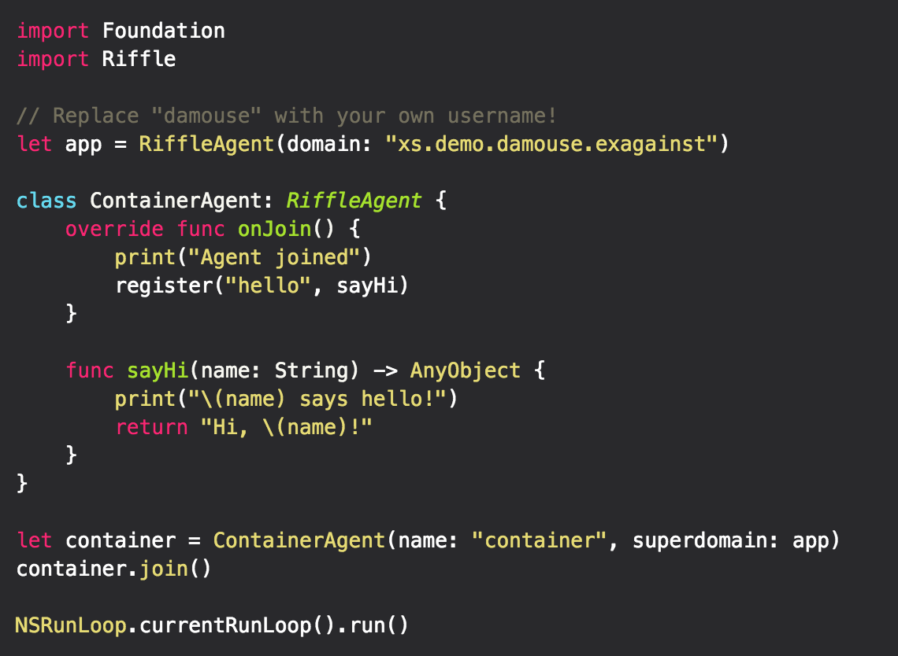
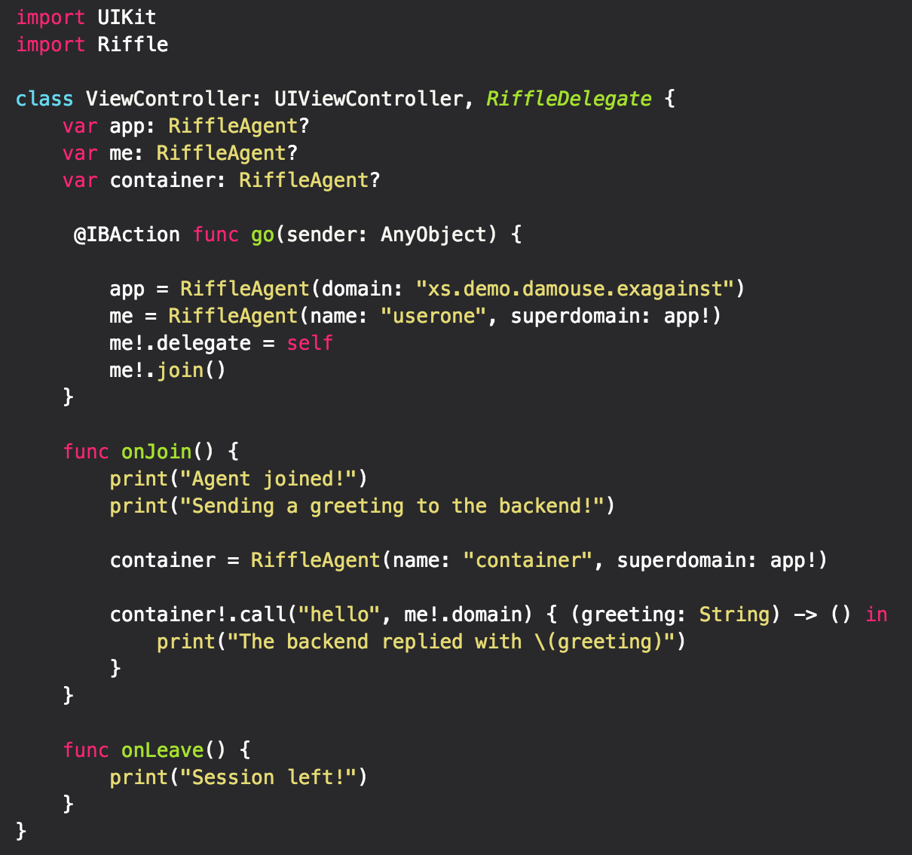

     <h1>Exis</h1> <h3>Stop writing network code. Seriously.</h3>

  

## Why Exis?
While we were developing Exis, simplicity and ease of use was at our highest priority.  With Exis, if you can make a function call, you can create incredibly complex apps in just minutes.  
No more needing to worry about learning several languages to create the backend suited for your needs.  Instead, use the languages that you know and are comfortable with.  We support WebSockets and HTTP - so if your device can talk to HTTP, it can use Exis.

### Example Code

<table align="center" border="0">

<tr>
<td>  </td>
<td>  </td>
</tr>

</table>

### Getting Started
Feel free to check out the examples directory where you can find Xcode projects that will show you how to get started using Exis.
* [Cards Against Humanity Example](https://github.com/exis-io/CardsAgainst)
	* [Cards Against Tutorial](http://docs.exis.io/#/pages/samples/SwiftCardsTutorial.md)
	* Here is a simple project that we created to show how powerful Exis is

### More Information
For more information on the how to incorporate Exis with your projects , please visit [exis.io](http://exis.io) or visit our [documentation page](http://docs.exis.io/#/pages/general/Home.md) to see more in depth tutorials.
