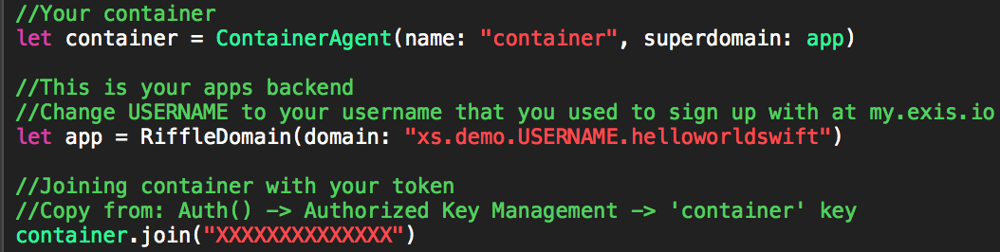

<div align="center">
   <br>
  <h3>Stop writing network code. Seriously.</h3>

</div>
<div align="center">
  
  
  
</div>
<br>
[Exis + Swift](http://exis.io/swift) is currently the best solution to allow Swift developers to run their code in the cloud. Exis allows developers to write native Swift code, test it locally in Xcode, and launch it in the cloud.

Feel free to checkout [other programming languages](https://github.com/exis-io/Exis) that Exis supports.

### Example

Server-side (cloud) code:
```
class Backend: RiffleDomain {
    override func onJoin() {
        register("hello", sayHi)
    }

    //Called by user frontend code
    func sayHi(name: String) -> AnyObject {
        print("\(name) says hello! Lets let him know Exis is here to help!")
        return "Hi, \(name)! Exis can hear you loud and clear!"
    }
}
```

Client-side (local) code:
```
//Send your request to your Swift backend!
@IBAction func sendRequest(sender: AnyObject) {

    container.call("hello", nameField.text!) { (response: String)  in
        print("There is someone out there!\nResponse: \(response)")
    }

}
```

## Getting started writing Swift in the backend

+ First, download or clone this repo to get your hands on our example project:<br>
`git clone https://github.com/exis-io/iOSExample.git`

+ In order to run our Hello World example you will need to head to [my.exis.io](https://my.exis.io) and create an account.<br>
After signing up you will follow these easy few steps to see the power of writing your backend in Swift using Exis!
+ Create an app from template 'helloWorldSwift' in your dashboard and leave the `Name(Optional)` blank

    <div style="text-align:center">
      
    </div>

+ Navigate to and open your `.xcworkspace` in the iOSExample project that you cloned or downloaded
  + You will find all the front end code in ```ViewController.swift``` and all your **Swift** written backend code in ```Backend/main.swift``` <br><br>
    <div style="text-align:center">
      
    </div><br>
  + There should be 2 lines of code in both your frontend and backend code that you are required to replace the ```X's``` with your keys and ```USERNAME``` with your username that you used during signup process.  Follow the inline comments on how to obtains those from your dashboard on [my.exis.io](https://my.exis.io)<br>
  <table align="center" border="0">
    <tr>
      <td>*Frontend Keys*  </td>
      <td>*Backend Keys* </td>
    </tr>
  </table>
  <div style="text-align:center">
    
  </div><br>
+ Now, go ahead and run your backend code by setting your current active scheme to *backend* and clicking run<br>

  <div style="text-align:center">
    
  </div><br>

+ After you have launched your backend running Swift, go ahead and run your main scheme and witness the communication between the two in your output log as well as in your View in the simulator.<br>

  <div style="text-align:center">
    
  </div><br>

+ You may switch between your backend output log and your front end to see the communication between the two!<br>

  <div style="text-align:center">
    
  </div>

## What now?

Now you have Swift backend code running locally for testing purposes.  Want to push to production? Next step is to push your Swift backend code to our cloud and we will host it for you and any of your clients to reach.

If you want to see how to launch your Swift backend code in the cloud, check out our more advanced tutorial, [Cards Against Humanity](https://github.com/exis-io/CardsAgainst) and its step-by-step [tutorial page](http://docs.exis.io/#/pages/samples/SwiftCardsTutorial.md) which will show you just how easy it is.
