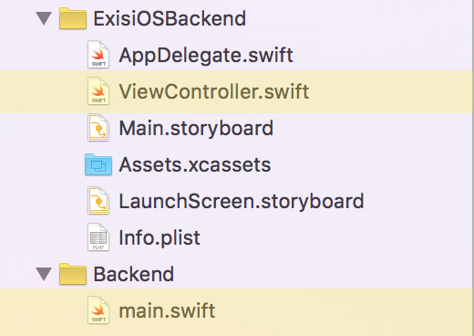
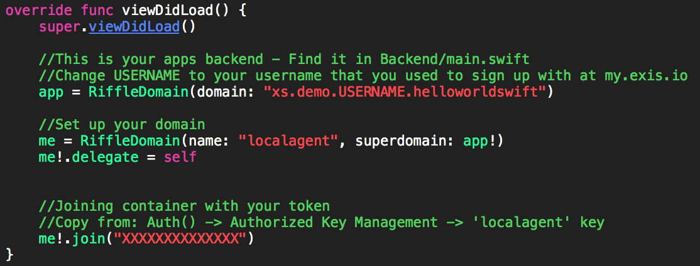
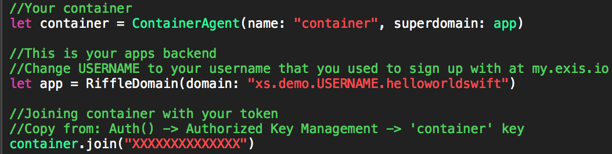
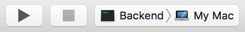
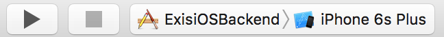
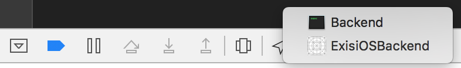

<div align="center">
   <br>
  <h3>Stop writing network code. Seriously.</h3>

</div>
<div align="center">
  
  
</div>

## Getting started writing Swift in the backend

In order to run our Hello World example you will need to head to [my.exis.io](https://my.exis.io) and create an account.<br>
After signing up you will follow these easy few steps to see the power of writing your backend in Swift using Exis!
+ Create an app from template 'helloWorldSwift' in your dashboard
+ Navigate to your .xcworkspace in the helloWorldSwift example that you cloned or downloaded
  + You will find all the front end code in ```ViewController.swift``` and all your **Swift** written backend code in ```Backend/main.swift``` <br>
    <div style="text-align:center">
      
    </div>
  + There should be 2 lines of code in both your frontend and backend code that you are required to replace the ```X's``` with your keys and ```USERNAME``` with your username that you used during signup process.  Follow the inline comments on how to obtains those from your dashboard on [my.exis.io](https://my.exis.io)<br>
  <table align="center" border="0">
    <tr>
      <td>*Frontend Keys*  </td>
      <td>*Backend Keys* </td>
    </tr>
  </table>
+ Now, go ahead and run your backend code by setting your current active scheme to *backend* and clicking run<br>
  <div style="text-align:center">
    
  </div>
+ After you have launched your backend running Swift, go ahead and run your main scheme and witness the communication between the two in your output log as well as in your View in the simulator.
  <div style="text-align:center">
    
  </div>
+ You may switch between your backend output log and your front end to see the communication between the two!
  <div style="text-align:center">
    
  </div>
